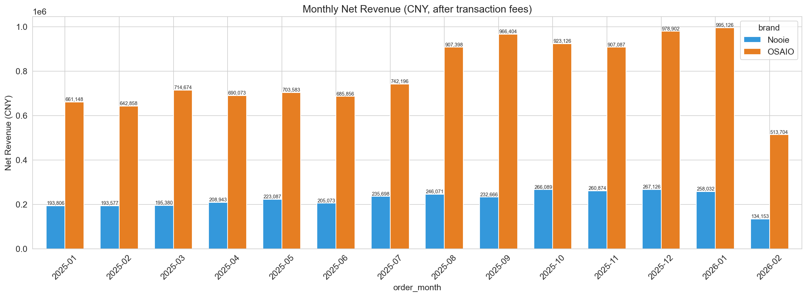
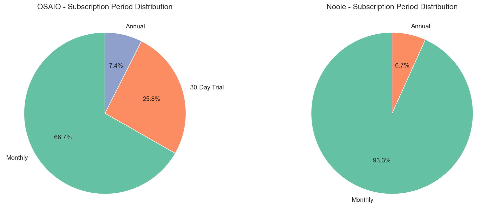
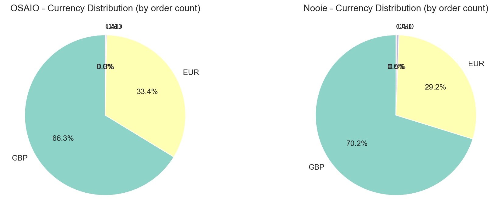
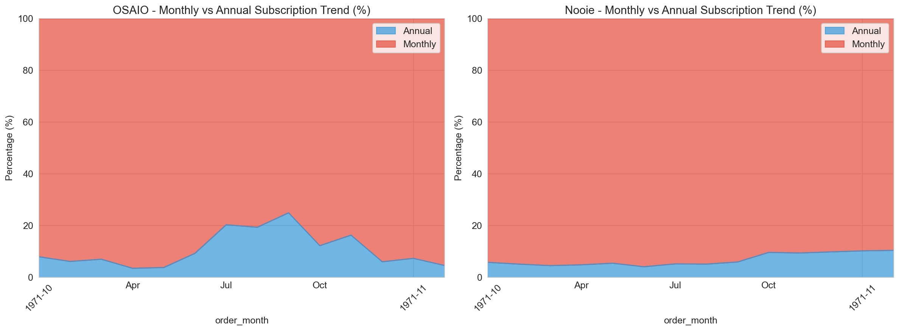
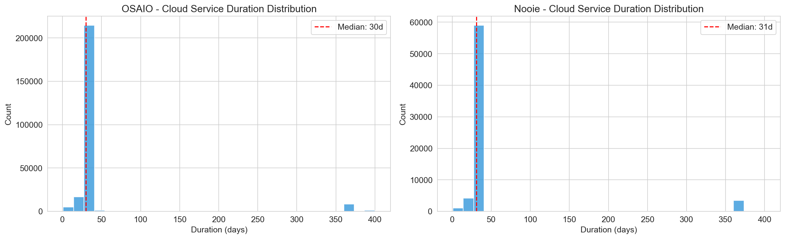
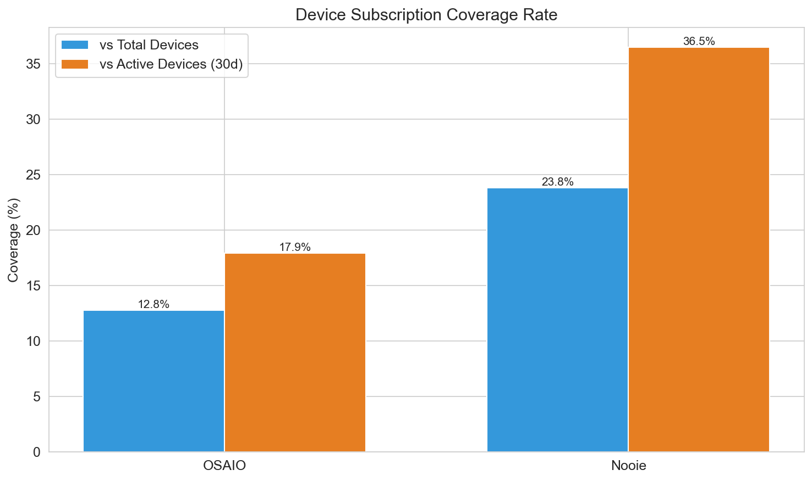
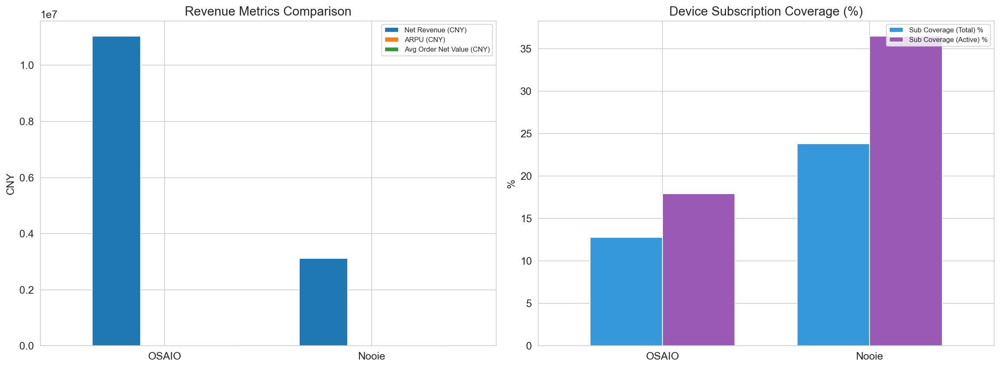

# EU区订单与订阅分析报告 (2025年至今)

**生成时间**: 2026-02-17 08:33  
**数据范围**: 2025-01-01 至今  
**数据来源**: 本地 SQLite (scripts/sync_order_data.py 同步)

---

## 1. 概览

| 指标 | OSAIO | Nooie |
|------|-------|-------|
| 付费订单数 | 234,604 | 64,899 |
| 付费用户数 | 31,570 | 9,629 |
| 净收入 (CNY) | 11,032,136.30 | 3,120,577.00 |
| ARPU (CNY) | 349.45 | 324.08 |
| 平均客单净值 (CNY) | 47.02 | 48.08 |
| 设备订阅覆盖率(总) | 12.8% | 23.81% |
| 设备订阅覆盖率(活跃) | 17.94% | 36.46% |

## 图表

---

**分析说明**:
- 付费订单: status=1 且 amount > 0
- 净营收 = amount_cny - transaction_fee_cny
- 首期/续费判定: 基于每个 subscribe_id 的全局最早 pay_time（含2025年前历史）
